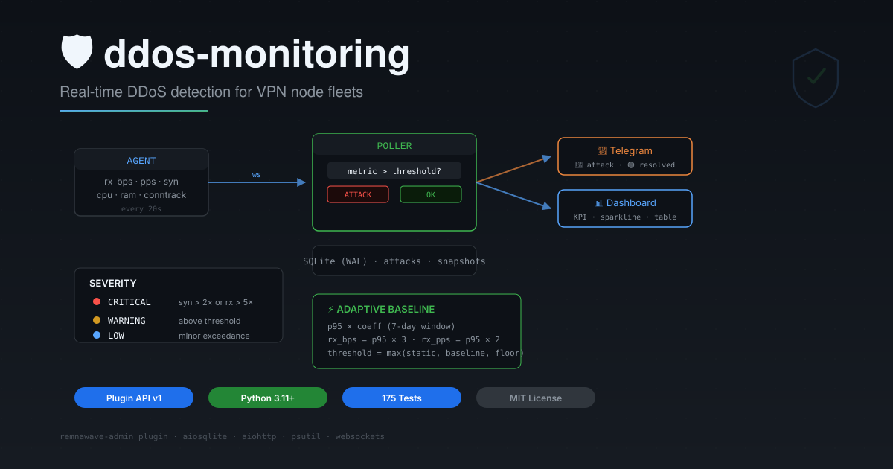

<div align="center">



# ddos-monitoring

**Реалтайм-детекция DDoS для VPN-инфраструктуры**

[](https://github.com/Case211/remnawave-admin)
[](https://www.python.org/)
[](#)
[](LICENSE)

Адаптивные пороги · Telegram-алерты · Встроенный дашборд · Автодеплой агентов

</div>

---

## Метрики

| Категория | Метрики | Детекция |
|-----------|---------|----------|
| 🌐 Трафик | `rx_bps` · `tx_bps` · `rx_pps` | Объёмные и packet-flood атаки |
| 🔌 TCP | `syn_recv` · `established` · `syncookies_ps` | SYN-flood, TCP overflow |
| 💧 Дропы | `listen_drop_ps` · `rx_drop_ps` | Queue overflow, NIC drops |
| 📊 Conntrack | `conntrack_count` · `conntrack_max` | Таблица соединений |
| ⚙️ Ресурсы | `cpu_pct` · `ram_pct` · `disk_pct` · `load1` | Ресурсное истощение |

---

## Пороги

### Статические (по умолчанию)

| Метрика | Порог | | Метрика | Порог |
|---------|-------|-|---------|-------|
| `rx_bps` | 200 Мбит/с | | `cpu` | 90% |
| `rx_pps` | 30K | | `ram` | 90% |
| `syncookies` | 200/с | | `disk` | 85% |
| `listen_drop` | 100/с | | `load/cpu` | 2.0 |
| `rx_drop` | 50/с | | `conntrack` | 75% |

### Baseline (адаптивные)

Включается через `baseline_mode=true`. Каждый час пересчёт p95 за 7 дней:

| Метрика | Формула | Минимум |
|---------|---------|---------|
| `rx_bps` | p95 × 3 | ≥ 20 Мбит/с |
| `rx_pps` | p95 × 2 | ≥ 5 000 |
| `syncookies` | p95 + 5 | ≥ 10 |
| `drops` | p95 + 5 | ≥ 5 |

**threshold = max(static, baseline, min_floor)** — каждая нода адаптируется к своему трафику.

---

## Lifecycle атаки

```
МЕТРИКА > ПОРОГ
      │
      ▼
 ┌─ Нет активной атаки? ─────────────────────────┐
 │  • Запись в attacks (started_at, severity)     │
 │  • Telegram: 🔴 АТАКА НА <нода>                │
 └────────────────────────────────────────────────┘
      │
      ▼  (метрика всё ещё выше)
 ┌─ Атака активна ────────────────────────────────┐
 │  • Обновление last_seen, severity, attack_type │
 └────────────────────────────────────────────────┘
      │
      ▼  (метрика ниже порога)
 ┌─ Завершение ───────────────────────────────────┐
 │  • ended_at = NOW()                            │
 │  • Telegram: 🟢 ЗАВЕРШЕНА (длительность)       │
 └────────────────────────────────────────────────┘
```

---

## Severity

| Уровень | Критерий |
|---------|----------|
| 🔴 **CRITICAL** | `syncookies > 2× порога` или `rx_bps > 5× порога` |
| 🟡 **WARNING** | Превышение порога (не critical) |
| 🔵 **LOW** | Незначительное превышение |

---

## Telegram-алерты

| Событие | Формат |
|---------|--------|
| Начало | `🔴 АТАКА НА <нода>` — тип, severity, метрики |
| Конец | `🟢 ЗАВЕРШЕНА: <нода>` — длительность, пик |
| Нода молчит | `⚪ Атака закрыта — нода не отвечает` |

---

## Dashboard

| Элемент | Описание |
|---------|----------|
| **KPI** | Всего нод · Online · Атаки · Max severity |
| **Гистограмма** | Атаки за 24ч по часам |
| **Карточки** | CPU/RAM bars · sparkline 8ч · severity pill · сортировка |
| **Таблица** | Нода · начало · конец · тип · severity · длительность |

---

## API

```
GET  /data                                  ← Fleet overview
GET  /details                               ← Детали ноды
GET  /history?node_uuid=...&range=1h        ← Sparkline
POST /nodes/order                           ← Сортировка
GET  /health                                ← Liveness
```

---

## Быстрый старт

```bash
# Плагин
cd /path/to/remnawave-admin
npm run plugins:install -- https://github.com/multi81/ddos-monitoring-remnawave-admin-panel
npm run plugins:build && systemctl restart remnawave-admin

# Агент (через UI или вручную)
curl -fsSL .../install.sh | bash -s -- --url wss://panel --token <token>
```

---

## Тесты

```bash
python -m pytest tests/ -v              # 175 тестов
python -m pytest tests/ -v -k "not remote"  # без SSH
```

---

<div align="center">

**Stack:** Python 3.11+ · aiohttp · aiosqlite · psutil · websockets · Telegram Bot API · lit-html

[Issues](https://github.com/multi81/ddos-monitoring-remnawave-admin-panel/issues) · [Remnawave Admin](https://github.com/Case211/remnawave-admin)

</div>
